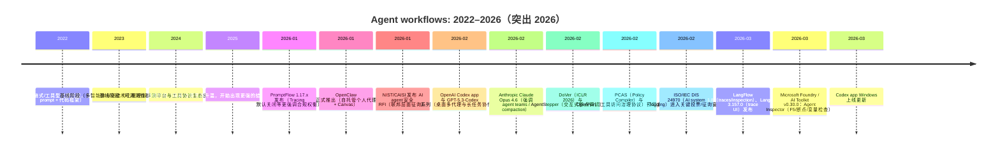

# 2026 年与 NormCode Canvas 相关的研究与产品进展综述

## 执行摘要

截至 2026-03-10（Europe/London），2026 年的“代理工作流”生态出现了一个明显拐点：从 2022–2025 年主要靠“框架 + 日志/Trace”来追踪与回放，开始向“**可执行约束/合同（contract）+ 可验证审计（verifiable logging）+ 交互式调试（breakpoints / step-through / replay）**”三条路线并行演进。学术界在 2026 年初集中产出了一批围绕“可执行约束”“政策编译器”“干预式自动调试”“可验证执行记录”的论文，把“上下文污染/漂移”“多步错误叠加”“审计与责任归因”这些痛点从经验问题推进到可形式化/可测评的问题域。citeturn17search3turn20search2turn19search0turn18search2turn23search0turn15search0

与此同时，产业界在 2026 年把 agentic 开发体验进一步“IDE 化”：一端是以 Claude Code、OpenAI Codex、OpenClaw 为代表的“长期运行、能改代码/跑命令、围绕会话与作业的个人/团队代理”；另一端是 LangFlow、PromptFlow、LangGraph、LangSmith、Langfuse 等将“可视化编排 + 可观测性/评测”继续做深，并开始引入更强的调试语义（例如“time-travel/回放分叉”“F5 调试/断点/变量检查”）。citeturn22search0turn13search0turn14search1turn5search14turn3search0turn16search1

对 NormCode Canvas 的启示可浓缩为一句话：**2026 年的增量竞争点不再是“能把节点连起来”，而是“能否把计划（plan）变成可移植、可隔离、可审计、可调试的工件（artifact）”。**在 2026 年新出现的路线里：  
- “可执行约束/合同”类工作（ContextCov、PARCER、OpenPort、PCAS）在逼近你们的“半形式语言 + 显式数据流”定位，但大多还停留在“为既有 agent 框架加护栏”的层级，缺少一个统一、可视化、可调试的计划 IR。citeturn20search0turn20search1turn19search1turn19search0  
- “交互式调试”类工作（AgentStepper、DoVer）证明了断点/逐步执行/回放分叉对 agent 可靠性与理解成本的直接收益，但它们往往不提供“语言级上下文隔离”，更多是对既有轨迹进行结构化呈现与干预。citeturn17search3turn20search2  
- “合规/标准”在 2026 年显著加速：欧盟 AI Act 的“自动日志记录（Article 12）”解释性材料持续完善；ISO 侧的 AI 系统日志标准 ISO/IEC DIS 24970 进入投票/征询关键阶段；美国 NIST（CAISI）在 2026 年发起 AI agent 安全征询并启动“AI Agent Standards Initiative”，将“身份、授权、可互操作、可审计”推向标准化轨道。citeturn23search1turn15search0turn23search0turn23search6

## 学术研究与预印本

下面条目均为 2026 年（发表/收录/发布或在 2026 年会议体系中公开）的增量；每个条目给出：引文、两句摘要、对 NormCode/Canvas 的关键局限、在 demo paper 中的落点，以及可用的 BibTeX（按公开元数据生成）。

**AgentStepper（交互式断点调试 agent 轨迹）**  
**引文：** Robert Hutter, Michael Pradel. *AgentStepper: Interactive Debugging of Software Development Agents*. arXiv, 2026. DOI: 10.48550/arXiv.2602.06593. citeturn17search3turn17search5turn17search8  
**摘要：** 论文把软件开发型代理的执行过程抽象为“事件序列/轨迹”，并提供断点、逐步执行与对提示词、工具调用的在线编辑，从而将 agent 调试类比为传统程序调试但提升到“高层 action”粒度。作者报告在三个 SOTA 代理上仅需很少代码改动即可接入，并通过 12 人用户研究显示其提升理解与定位 bug 的能力、降低挫败感。citeturn17search3turn17search5  
**关键局限：** AgentStepper提升的是“对既有 agent 的轨迹可视化与干预”，并不提供一个语言级的“步骤显式 I/O + 上下文隔离计划表示”；因此难以把“计划工件”作为可移植、可审计的 IR 在不同运行时之间交换（更偏调试器而非工作流语言）。citeturn17search3  
**相关性：** Related Work（调试/IDE 传统）、Technical background（为何需要断点/状态检查）。  
**BibTeX：**
```bibtex
@article{hutter2026agentstepper,
  title = {AgentStepper: Interactive Debugging of Software Development Agents},
  author = {Hutter, Robert and Pradel, Michael},
  year = {2026},
  journal = {arXiv preprint arXiv:2602.06593},
  doi = {10.48550/arXiv.2602.06593},
  url = {https://arxiv.org/abs/2602.06593}
}
```

**DoVer（干预驱动的多代理自动调试）**  
**引文：** Ming Ma et al. *DoVer: Intervention-Driven Auto Debugging for LLM Multi-Agent Systems*. ICLR 2026 (Poster), OpenReview, 2026；另有 arXiv:2512.06749（2025-12 预印本）。citeturn20search2turn20search5turn20search8  
**摘要：** DoVer 将“仅靠日志归因”的调试范式推进为“提出假设→执行针对性干预→验证/修复”的闭环，并以“是否恢复任务成功/是否推进里程碑”而不是“归因是否正确”作为更贴近工程的指标。论文在 Magnetic-One 等框架与多个数据集上报告能把一部分失败 trial 翻转为成功，并能验证/证伪相当比例的失败假设。citeturn20search5turn20search2  
**关键局限：** DoVer 的核心依赖于对轨迹进行干预与回放，并不要求计划语言有“强制隔离”的结构约束；因此它更像“后置调试策略/元流程”，而不是让计划本身天然可审计、可移植、可局部重跑的 IR。citeturn20search2  
**相关性：** Related Work（调试方法）、Technical background（回放/分叉调试思想）。  
**BibTeX：**
```bibtex
@inproceedings{ma2026dover,
  title = {DoVer: Intervention-Driven Auto Debugging for LLM Multi-Agent Systems},
  author = {Ma, Ming and Zhang, Jue and Yang, Fangkai and Kang, Yu and Lin, Qingwei and Rajmohan, Saravan and Zhang, Dongmei},
  booktitle = {International Conference on Learning Representations (ICLR) 2026},
  year = {2026},
  url = {https://openreview.net/forum?id=mrEK16Jy6h}
}
```

**ContextCov（把 Agent Instruction 变成可执行约束）**  
**引文：** Reshabh K. Sharma. *ContextCov: Deriving and Enforcing Executable Constraints from Agent Instruction Files*. arXiv, 2026. URL: arXiv:2603.00822. citeturn20search0turn20search3  
**摘要：** ContextCov 指出“指令文件是被动文本、不可执行规范”，容易导致 agent 产生违背约束的修改并在无人监督下累积成技术债。其方法从指令文件中抽取可验证约束，结合代码生成与运行时 enforcement 层，把部分约束转化为可自动检查/阻止的护栏。citeturn20search0turn20search3  
**关键局限：** ContextCov 的约束来源主要是“从自然语言指令里抽取可验证片段”，可覆盖范围受限；它强化的是“约束执行”，未必提供“步骤级显式 I/O + 数据隔离”的统一计划 IR，也未必给出像 Canvas 那样面向非工程角色的可视化执行/调试体验。citeturn20search0  
**相关性：** Related Work（语言/规范化护栏）、Introduction framing（上下文漂移痛点）。  
**BibTeX：**
```bibtex
@article{sharma2026contextcov,
  title = {ContextCov: Deriving and Enforcing Executable Constraints from Agent Instruction Files},
  author = {Sharma, Reshabh K.},
  year = {2026},
  journal = {arXiv preprint arXiv:2603.00822},
  url = {https://arxiv.org/abs/2603.00822}
}
```

**PCAS（Policy Compiler for Secure Agentic Systems，信息流/因果图 + 参考监控器）**  
**引文：** Nils Palumbo et al. *Policy Compiler for Secure Agentic Systems*. arXiv, 2026. citeturn19search0turn19search4  
**摘要：** PCAS 认为把授权/合规策略写进 prompt 无法获得执行保证，于是提供“策略→编译→插桩”的路径：用依赖图表示 agent 状态与因果关系，以 Datalog 衍生策略语言表达跨事件/跨 agent 的可传递信息流限制，并由 reference monitor 在动作执行前拦截违规。论文在多个案例中报告显著提高策略符合率，并强调线性消息历史无法表达的信息流问题。citeturn19search0turn19search4  
**关键局限：** PCAS 解决的是“在既有 agent 实现之上做确定性策略执行”，其工件通常是“策略 + 插桩系统”，而非一个可移植、可审计、可在 IDE 中直接编辑的计划语言；对“上下文隔离的计划 IR + 可视化单步调试”支持在公开描述中不突出。citeturn19search0  
**相关性：** Related Work（治理/隔离/信息流控制）、Technical background（显式数据流与合规）。  
**BibTeX：**
```bibtex
@article{palumbo2026pcas,
  title = {Policy Compiler for Secure Agentic Systems},
  author = {Palumbo, Nils and Choudhary, Sarthak and Choi, Jihye and Chalasani, Prasad and Jha, Somesh},
  year = {2026},
  journal = {arXiv preprint arXiv:2602.16708},
  url = {https://arxiv.org/abs/2602.16708}
}
```

**OpenPort Protocol（工具访问治理规范：稳定响应包络 + 可机器处理 reason codes）**  
**引文：** Genliang Zhu et al. *OpenPort Protocol: A Security Governance Specification for AI Agent Tool Access*. arXiv, 2026. citeturn19search1turn19search5turn19search9  
**摘要：** OpenPort 把“工具暴露/调用”从 ad-hoc API 变成治理优先的协议：支持依赖授权的 discovery、稳定的 response envelope、可机器处理的 agent.\* 失败原因码，并将集成凭据、细粒度权限与 ABAC 约束组合为统一授权模型。其目标是在模型/运行时中立的服务器端网关上表达最小权限、可控写入、可预测失败与审计等属性。citeturn19search1turn19search5  
**关键局限：** OpenPort 主要规范“工具层访问与授权”，并不等价于“对多步计划的上下文与数据流隔离”；它更多回答“工具怎么安全接入”，较少覆盖“计划怎么可视化调试、怎么作为可移植 IR 被审查/复用”。citeturn19search1  
**相关性：** Intro framing（治理/授权）、Technical background（工具协议与审计）。  
**BibTeX：**
```bibtex
@article{zhu2026openport,
  title = {OpenPort Protocol: A Security Governance Specification for AI Agent Tool Access},
  author = {Zhu, Genliang and Wang, Chu and Wang, Ziyuan and Li, Zhida and Li, Qiang},
  year = {2026},
  journal = {arXiv preprint arXiv:2602.20196},
  url = {https://arxiv.org/abs/2602.20196}
}
```

**Right to History / PunkGo（可验证的 agent 行为历史：Merkle 审计日志 + 能力隔离 + 人工审批）**  
**引文：** Jing Zhang. *Right to History: A Sovereignty Kernel for Verifiable AI Agent Execution*. arXiv, 2026. citeturn18search2turn18search4turn18search7  
**摘要：** 论文提出“历史权（Right to History）”：个体有权获得其设备上 AI agent 所有动作的完整、可验证记录，并实现了名为 PunkGo 的“主权内核”，结合 Merkle 审计日志、基于能力的隔离、能耗预算治理与人工审批。作者报告其能提供可独立验证的包含证明，并给出性能数据以论证可用性。citeturn18search2turn18search4  
**关键局限：** 该工作把焦点放在“可信执行记录与 OS 级隔离”，而不是“计划语言/上下文隔离 IR”；它能为 NormCode/Canvas 的审计链提供系统层支撑，但不能直接替代“步骤级显式 I/O + 可视化调试”的语言/IDE 体验。citeturn18search2  
**相关性：** Introduction framing（合规/审计）、Technical background（可验证日志）。  
**BibTeX：**
```bibtex
@article{zhang2026righttohistory,
  title = {Right to History: A Sovereignty Kernel for Verifiable AI Agent Execution},
  author = {Zhang, Jing},
  year = {2026},
  journal = {arXiv preprint arXiv:2602.20214},
  url = {https://arxiv.org/abs/2602.20214}
}
```

**AI Agents Need Memory Control Over More Context（内存控制：压缩认知状态替代 transcript replay）**  
**引文：** Fouad Bousetouane. *AI Agents Need Memory Control Over More Context*. arXiv, 2026. citeturn19search3turn19search7  
**摘要：** 论文将多轮 agent 退化归因到“无界上下文增长 + 噪声回忆/记忆投毒 + 漂移”，提出 Agent Cognitive Compressor（ACC）以“有界内部状态”替代 transcript replay，并显式区分“检索候选信息”与“状态承诺”。其目标是在长期交互中保持稳定条件化，降低漂移与幻觉累积。citeturn19search3turn19search7  
**关键局限：** ACC 是“记忆/上下文管理模块”，并不构成一个可审计的计划 IR；它缓解“污染/膨胀”，但不直接提供“每一步显式 I/O、跨步骤数据隔离、可视化断点调试”的工程化工件形态。citeturn19search3  
**相关性：** Technical background（上下文污染/漂移问题动机）。  
**BibTeX：**
```bibtex
@article{bousetouane2026memorycontrol,
  title = {AI Agents Need Memory Control Over More Context},
  author = {Bousetouane, Fouad},
  year = {2026},
  journal = {arXiv preprint arXiv:2601.11653},
  url = {https://arxiv.org/abs/2601.11653}
}
```

**Intelligence Degradation in Long-Context LLMs（长上下文“临界阈值崩塌”刻画）**  
**引文：** Weiwei Wang, Jiyong Min, Weijie Zou. *Intelligence Degradation in Long-Context LLMs: Critical Threshold Determination via Natural Length Distribution Analysis*. arXiv, 2026. citeturn21search0turn21search4  
**摘要：** 作者提出“智能退化”现象：当上下文逼近某些临界阈值时，模型性能会出现灾难性下降，并用“自然长度分布分析”尝试更直接地证明退化来自长度本身而非截断/填充工艺。论文给出阈值识别与交叉验证框架，并以开源模型实验报告某些比例区间内 F1 等指标显著下滑。citeturn21search0turn21search4  
**关键局限：** 该工作提供的是“现象刻画与评估方法”，并不直接给出工作流语言/IDE 方案；NormCode/Canvas 需要把“退化风险”转译为“结构化隔离/显式数据流”的工程机制。citeturn21search0  
**相关性：** Introduction framing（技术动机）、Technical background（长上下文退化）。  
**BibTeX：**
```bibtex
@article{wang2026intelligencedegradation,
  title = {Intelligence Degradation in Long-Context LLMs: Critical Threshold Determination via Natural Length Distribution Analysis},
  author = {Wang, Weiwei and Min, Jiyong and Zou, Weijie},
  year = {2026},
  journal = {arXiv preprint arXiv:2601.15300},
  url = {https://arxiv.org/abs/2601.15300}
}
```

**Long Context, Less Focus（长上下文注意力稀释与可扩展性缺口）**  
**引文：** Shangding Gu. *Long Context, Less Focus: A Scaling Gap in LLMs Revealed through Privacy and Personalization*. arXiv, 2026. citeturn21search1turn21search5  
**摘要：** 作者通过隐私与个性化场景分析指出“上下文越长，注意力越分散”的可扩展性缺口，并给出经验与理论分析（将其与 soft attention 的容量限制联系）。论文同时声称发布基准以支持可复现实验。citeturn21search5turn21search1  
**关键局限：** 该工作关注模型机制层面的“长上下文泛化/隐私”问题，未直接处理“多步计划如何隔离数据、如何在 IDE 中逐步检查状态”；对 NormCode/Canvas 更像是“反证/动机材料”。citeturn21search1  
**相关性：** Introduction framing（长上下文风险）。  
**BibTeX：**
```bibtex
@article{gu2026longcontextlessfocus,
  title = {Long Context, Less Focus: A Scaling Gap in LLMs Revealed through Privacy and Personalization},
  author = {Gu, Shangding},
  year = {2026},
  journal = {arXiv preprint arXiv:2602.15028},
  url = {https://arxiv.org/abs/2602.15028}
}
```

**AOrchestra（以四元组抽象自动生成子代理的编排）**  
**引文：** Jianhao Ruan et al. *AOrchestra: Automating Sub-Agent Creation for Agentic Orchestration*. arXiv, 2026. citeturn21search3turn21search11turn21search19  
**摘要：** AOrchestra把 agent 抽象为（Instruction, Context, Tools, Model）四元组，并让中心 orchestrator 在每一步按任务动态“具体化”四元组，按需生成专门子代理作为工具执行。论文强调其框架无关性，并在 GAIA、SWE-Bench、Terminal-Bench 等基准上报告相对提升，并开放代码。citeturn21search3turn21search19  
**关键局限：** 四元组抽象接近一种“轻量 IR”，但其 Context 仍由 orchestrator 选择性拼装，并未天然强制“步骤间数据隔离/显式 I/O 约束”；此外，论文并未以“可视化 IDE + 可审计计划工件”为主轴。citeturn21search3  
**相关性：** Related Work（编排/IR）、Technical background（子代理范式）。  
**BibTeX：**
```bibtex
@article{ruan2026aorchestra,
  title = {AOrchestra: Automating Sub-Agent Creation for Agentic Orchestration},
  author = {Ruan, Jianhao and Xu, Zhihao and Peng, Yiran and Ren, Fashen and Yu, Zhaoyang and Liang, Xinbing and Xiang, Jinyu and Liu, Bang and Wu, Chenglin and Luo, Yuyu and Zhang, Jiayi},
  year = {2026},
  journal = {arXiv preprint arXiv:2602.03786},
  url = {https://arxiv.org/abs/2602.03786}
}
```

**An Empirical Study of Bugs in Modern LLM Agent Frameworks（框架层 bug 分类学）**  
**引文：** Xinxue Zhu et al. *An Empirical Study of Bugs in Modern LLM Agent Frameworks*. arXiv, 2026. citeturn21search2turn21search10turn21search6  
**摘要：** 作者系统分析 CrewAI 与 LangChain 的近千条 bug report，构建 root cause 与 symptom 的分类学，并定位 bug 在 agent 生命周期各阶段的分布。其结果强调“框架层 bug”与“agent 行为失败”不同，且 API 不兼容、文档失配等工程问题会直接破坏控制流与任务推进。citeturn21search2turn21search6  
**关键局限：** 该研究是诊断性分析，并不直接给出“语言级隔离 + 可视化调试”的解决方案；但它为 NormCode/Canvas 的“可调试性/可审计性是刚需”提供经验性证据。citeturn21search2  
**相关性：** Introduction framing（痛点证据）、Related Work（调试与可靠性）。  
**BibTeX：**
```bibtex
@article{zhu2026agentframeworkbugs,
  title = {An Empirical Study of Bugs in Modern LLM Agent Frameworks},
  author = {Zhu, Xinxue and Wu, Jiacong and Zhang, Xiaoyu and Li, Tianlin and Mu, Yanzhou and Zhai, Juan and Shen, Chao and Liu, Yang},
  year = {2026},
  journal = {arXiv preprint arXiv:2602.21806},
  url = {https://arxiv.org/abs/2602.21806}
}
```

**Towards Verifiably Safe Tool Use for LLM Agents（把安全需求形式化为可执行规范）**  
**引文：** Aarya Doshi et al. *Towards Verifiably Safe Tool Use for LLM Agents*. ICSE-NIER 2026，DOI: 10.1145/3786582.3786839；arXiv:2601.08012。citeturn19search2turn19search18turn19search6  
**摘要：** 该工作主张从系统工程的 STPA（System-Theoretic Process Analysis）出发识别 agent 工作流 hazard，将安全需求转译为对数据流与工具序列的可执行约束，并提到以“能力/机密性/信任标签”增强 MCP 风格的工具框架。其目标是让安全不依赖模型“自觉”，而由可验证机制保障。citeturn19search18turn19search6  
**关键局限：** 该论文更像“方法与方向性框架”，强调从 hazard 到约束的流程；它并未提供一个面向非程序员的可视化 IDE，也未必给出“计划 IR 的可移植性/审计工件结构”的完整语言设计。citeturn19search18  
**相关性：** Related Work（形式化安全/工具使用）、Intro framing（安全与合规动机）。  
**BibTeX：**
```bibtex
@inproceedings{doshi2026verifiablysafe,
  title = {Towards Verifiably Safe Tool Use for LLM Agents},
  author = {Doshi, Aarya and Hong, Yining and Xu, Congying and Kang, Eunsuk and Kastner, Christian and others},
  booktitle = {ICSE-NIER '26: 2026 IEEE/ACM International Conference on Software Engineering (NIER)},
  year = {2026},
  doi = {10.1145/3786582.3786839},
  url = {https://arxiv.org/abs/2601.08012}
}
```

**ACE（对 IsolateGPT 的 2026 路线升级：抽象-具体-执行 + 信息流验证 + 执行隔离）**  
**引文：** Evan Li et al. *ACE: A Security Architecture for LLM-Integrated App Systems*. NDSS 2026. DOI: 10.14722/ndss.2026.230352；NDSS 页面与论文。citeturn17search0turn17search1turn17search11turn17search17  
**摘要：** ACE 在 LLM 集成第三方 app 的系统里，识别并演示了可破坏规划完整性与执行完整性的攻击，并在 IsolateGPT 等防护思路上继续推进：将规划分为“仅基于可信信息的抽象计划”与“映射到已安装系统 app 的具体计划”，并用静态分析验证结构化计划满足信息流约束。执行阶段通过数据与能力边界隔离 app，并保证执行遵循可信抽象计划。citeturn17search0turn17search2turn17search1  
**关键局限：** ACE 的“结构化计划输出 + 信息流约束验证”与 NormCode 的语言级隔离精神高度接近，但其定位仍是“安全架构/参考实现”而不是面向广泛工作流作者的“可移植计划语言 + 可视化 IDE”；对通用编排生态的可用性与可编辑性（尤其是非程序员）仍有距离。citeturn17search0  
**相关性：** Related Work（执行隔离/安全架构）、Technical background（信息流与隔离）。  
**BibTeX：**
```bibtex
@inproceedings{li2026ace,
  title = {ACE: A Security Architecture for LLM-Integrated App Systems},
  author = {Li, Evan and Mallick, Tushin and Rose, Evan and Robertson, William and Oprea, Alina and Nita-Rotaru, Cristina},
  booktitle = {Network and Distributed System Security Symposium (NDSS) 2026},
  year = {2026},
  doi = {10.14722/ndss.2026.230352},
  url = {https://www.ndss-symposium.org/ndss-paper/ace-a-security-architecture-for-llm-integrated-app-systems/}
}
```

**SAGA（多代理治理/身份与访问控制：用户可控生命周期）**  
**引文：** Georgios Syros et al. *SAGA: A Security Architecture for Governing AI Agentic Systems*. NDSS 2026；arXiv:2504.21034（预印本）。citeturn18search1turn18search3turn18search0  
**摘要：** SAGA 将治理焦点放在 agent 身份、注册、授权与 agent-to-agent 通信控制上，提出由“Provider”维护元数据与用户定义策略，并用密码机制生成细粒度访问控制 token。论文强调它填补“纯理论治理设计缺乏实现评估”的空白，并报告在多地理位置与多种设备/云模型上的开销评估。citeturn18search0turn18search1  
**关键局限：** SAGA 是“治理与通信控制架构”，并不直接提供“步骤级上下文隔离计划语言/可视化执行调试”；对 NormCode/Canvas 来说，它更像“外部治理层/身份授权层”的互补，而非替代。citeturn18search1  
**相关性：** Intro framing（治理、身份与授权）、Related Work（多代理安全）。  
**BibTeX：**
```bibtex
@inproceedings{syros2026saga,
  title = {SAGA: A Security Architecture for Governing AI Agentic Systems},
  author = {Syros, Georgios and Suri, Anshuman and Ginesin, Jacob and Nita-Rotaru, Cristina and Oprea, Alina},
  booktitle = {Network and Distributed System Security Symposium (NDSS) 2026},
  year = {2026},
  url = {https://www.ndss-symposium.org/ndss-paper/saga-a-security-architecture-for-governing-ai-agentic-systems/}
}
```

## 工具与产品动向

本节仅覆盖 2026 年“新增/重大更新/治理变化”且与 NormCode Canvas（语言 + 可视化运行/调试）直接相关的产品与开源项目；每个条目都按同一模板给出。

image_group{"layout":"carousel","aspect_ratio":"16:9","query":["OpenAI Codex app screenshot 2026","Claude Code terminal screenshot","Langflow traces inspection panel screenshot","Microsoft AI Toolkit VS Code Agent Inspector screenshot"],"num_per_query":1}

**OpenAI Codex（桌面 app + 新模型 + 加速变体）**  
**引文：** *Introducing the Codex app*（含 2026-03-04 Windows 上线更新）；*Introducing GPT‑5.3‑Codex*（2026-02-05）；*Introducing GPT‑5.3‑Codex‑Spark*（2026-02-12）。citeturn13search0turn13search1turn13search4  
**摘要：** 2026 年初 Codex 从 CLI/IDE 扩展为桌面“多代理指挥中心”：强调并行多 agent、长任务协作，并在 2026-03-04 更新中加入 Windows 版本。同期 GPT‑5.3‑Codex 与 Codex‑Spark（研究预览）将“在电脑上完成专业工作”的能力与低延迟实时交互作为卖点。citeturn13search0turn13search1turn13search4  
**关键局限：** Codex 的“工作隔离”更多体现在代码工作区/工作树等工程实践上（面向编码任务很有效），但并不等价于“任意多步工作流的语言级显式 I/O 隔离”；其工件与调试语义主要围绕代码与作业，而不是可移植的通用计划 IR。citeturn13search0turn13search1  
**相关性：** Intro framing（agentic coding 成为主战场）、Related Work（端到端 agent 产品）。  
**BibTeX：**
```bibtex
@misc{openai2026codexapp,
  title = {Introducing the Codex app},
  author = {{OpenAI}},
  year = {2026},
  url = {https://openai.com/index/introducing-the-codex-app/}
}
```

**Codex Security（安全审计代理：验证发现 + 沙箱压测 + 可视化 validated findings）**  
**引文：** *Codex Security: now in research preview*. OpenAI, 2026（页面发布时间见条目）。citeturn13search15  
**摘要：** Codex Security 将代码安全扫描从“模式匹配/静态分析”推进到“基于项目上下文建立威胁模型→验证/压测发现→给出修复”的代理式流程，并强调在沙箱环境中区分信噪、输出更高置信 finding。它把“可验证的中间分析/validated findings”作为产品面向审计与工程落地的关键界面。citeturn13search15  
**关键局限：** 该产品聚焦“安全分析”而非“通用工作流编排”；即便它产出可审查的 findings，也不提供跨领域工作流的语言级隔离计划与可视化调试环境（NormCode/Canvas 的核心差异点）。citeturn13search15  
**相关性：** Intro framing（审计/合规的强需求）、Related Work（后置审计 vs 结构化隔离）。  
**BibTeX：**
```bibtex
@misc{openai2026codexsecurity,
  title = {Codex Security: now in research preview},
  author = {{OpenAI}},
  year = {2026},
  url = {https://openai.com/index/codex-security-now-in-research-preview/}
}
```

**Claude Code（终端/IDE/桌面/浏览器的 agentic coding；强调读全仓、跑命令、编辑文件）**  
**引文：** Claude Code 官方文档 Overview（持续更新）；Claude Opus 4.6 公告提到 Claude Code 的“agent teams”等能力。citeturn22search0turn22search8  
**摘要：** Claude Code 被定位为“会读代码库、能改文件、能跑命令并集成开发工具”的 agentic coding 工具，覆盖终端与 IDE 等多种使用面。Anthropic 在 Opus 4.6 公告中进一步把“组建 agent teams、上下文压缩/compaction 支持长任务”等能力与其产品形态关联。citeturn22search0turn22search8  
**关键局限：** Claude Code 的核心工件仍以“代码与会话”为中心，缺少一个通用的、可移植且可审计的工作流语言；其“能做什么”更多来自强模型与工具接入，而非“按构造保证步骤间数据隔离”的计划语义。citeturn22search0turn22search8  
**相关性：** Related Work（agentic coding 产品）、Intro framing（长期任务与上下文管理）。  
**BibTeX：**
```bibtex
@misc{anthropic2026claudecodeoverview,
  title = {Claude Code overview},
  author = {{Anthropic}},
  year = {2026},
  url = {https://docs.anthropic.com/en/docs/agents-and-tools/claude-code/overview}
}
```

**Claude Code Security（将安全扫描“产品化”：面向防守方的 agent 化漏洞发现与修复建议）**  
**引文：** Anthropic 公告 *Making frontier cybersecurity capabilities available to everyone*（Claude Code Security），2026-02-20。citeturn22search1  
**摘要：** Claude Code Security 将“像安全研究员一样理解代码与数据流”的能力封装为产品能力，用于发现漏洞并给出可供人工审阅的补丁建议。Anthropic 将其叙事置于“攻防两端都会使用 AI”背景下，强调提升行业整体安全基线。citeturn22search1  
**关键局限：** 与 Codex Security 类似，它是特定领域（安全）深工作流，而不是一个通用的计划语言与可视化 IDE；因此它能证明“审计/验证 UI 的价值”，但不替代 NormCode/Canvas 的“跨领域计划 IR + 结构隔离”。citeturn22search1  
**相关性：** Intro framing（审计/验证的重要性）、Related Work（特定领域 agent 产品）。  
**BibTeX：**
```bibtex
@misc{anthropic2026claudecodesecurity,
  title = {Making frontier cybersecurity capabilities available to everyone},
  author = {{Anthropic}},
  year = {2026},
  url = {https://www.anthropic.com/news/claude-code-security}
}
```

**OpenClaw（自托管个人代理：多渠道网关 + 会话/技能生态 + Live Canvas）**  
**引文：** OpenClaw 官方介绍与文档；Reuters 报道其基金会化/与 OpenAI 的关系变化，以及在中国的地方政策推动。citeturn14search5turn14search1turn14news45turn14news36  
**摘要：** OpenClaw 将“个人长期运行代理”做成自托管网关：连接多种聊天渠道，并强调“由你控制数据/硬件”，同时支持 agent-native 的会话、记忆与多代理路由，并可渲染可交互的 Canvas。2026 年它同时经历了治理与生态层面的剧烈变化（基金会化、地方政府推动、围绕技能/安全的争议），使其成为“个人代理 + 技能供应链风险”的代表案例。citeturn14search1turn14search5turn14news45turn14news36  
**关键局限：** OpenClaw 强在“个人代理运行时与集成”，但其工作流/计划表示并非以“步骤显式 I/O 隔离”为中心；另外，技能生态的安全与审计压力（尤其是开放市场场景）反而凸显“结构化、可审计计划工件”的必要性，但 OpenClaw 本身不等价于这类语言/IDE。citeturn14search1turn14news36turn14news45  
**相关性：** Intro framing（个人代理与合规/安全风险）、Related Work（开放生态与可审计性）。  
**BibTeX：**
```bibtex
@misc{openclaw2026docs,
  title = {OpenClaw Docs},
  author = {{OpenClaw}},
  year = {2026},
  url = {https://docs.openclaw.ai/}
}
```

**LangFlow 1.8（可视化 builder 加强 tracing/inspection）**  
**引文：** LangFlow 1.8 博文（2026-03-06）与 GitHub Release v1.8.0（2026-03-05）。citeturn5search14turn5search26  
**摘要：** LangFlow 1.8 将“更快排障/调试”作为核心卖点之一，突出 traces 功能、Inspection Panel 等 UI 改进，同时推进更易程序化集成的 workflow API（V2 endpoints，beta）。这代表可视化工具在 2026 年继续向“可观测性 + 可集成工件（API）”方向补齐。citeturn5search14turn5search26  
**关键局限：** LangFlow 的可视化数据流主要服务于其自身组件生态，对“语言级强制上下文隔离/审计型计划工件”的支持在公开发布说明中不突出；因此更像“可视化装配 + trace”，而非“可移植的隔离计划语言”。citeturn5search14  
**相关性：** Related Work（直接可视化竞品）。  
**BibTeX：**
```bibtex
@misc{langflow2026v18,
  title = {Langflow 1.8 released: Global model provider setup, V2 workflow APIs, and faster debugging},
  author = {{Langflow Dev Team}},
  year = {2026},
  url = {https://www.langflow.org/blog}
}
```

**LangGraph（time-travel/回放分叉 + CLI 迭代）**  
**引文：** LangGraph 文档 “Use time-travel”；LangGraph CLI GitHub Release（2026-03-09）。citeturn3search0turn3search30  
**摘要：** LangGraph 在公开文档中把“time-travel”作为一类能力：在基于 checkpoint 的执行记录上支持重放、分叉与回溯式调试语义。2026 年 3 月其 CLI 发布继续强化本地/部署工作流，体现“图运行时 + 可回放状态”的工程化路线。citeturn3search0turn3search30  
**关键局限：** LangGraph 的调试语义更多围绕“图状态与 checkpoint”，但并不天然强制计划步骤的上下文隔离（需要工程约束/策略层配合）；同时其工件多为代码/SDK 表达，对非程序员参与与跨平台“语言级可移植计划”仍有限。citeturn3search0  
**相关性：** Related Work（框架/编排 + 调试能力）。  
**BibTeX：**
```bibtex
@misc{langgraph2026timetravel,
  title = {Use time-travel (LangGraph Documentation)},
  author = {{LangChain}},
  year = {2026},
  url = {https://docs.langchain.com/oss/python/langgraph/time-travel/}
}
```

**LangSmith（可观测性平台继续工程化：Agent Server changelog）**  
**引文：** LangSmith Agent Server 变更日志（2026-02-03）。citeturn5search2  
**摘要：** 2026 年 2 月的 Agent Server 更新延续“生产可观测性/传输协议/可运维性”的工程化方向（例如 gRPC streaming、灾备场景的采样与 trace replica、OTel opt-in 等）。这反映 LangSmith 在 2026 年仍以“记录、评测与运维”作为主轴，而不是把计划变成独立的语言工件。citeturn5search2  
**关键局限：** LangSmith 强在 trace 与评测，但其本质是“后置记录/分析平台”，并不以“结构化计划语言 + 步骤隔离”为核心机制；对 NormCode/Canvas 更像互补（可接入日志），但难以替代“按构造可审计的计划”。citeturn5search2  
**相关性：** Related Work（可观测性与调试）。  
**BibTeX：**
```bibtex
@misc{langsmith2026agentserver,
  title = {LangSmith Agent Server Changelog (2026-02-03)},
  author = {{LangChain}},
  year = {2026},
  url = {https://changelog.langchain.com/?project=proj_KdNfRrkvA4cew0eiA4Zg&ref=blog.langchain.com}
}
```

**PromptFlow（开源 SDK 1.17 + “Tracing 默认关闭”与生产 tracing/反馈文档）**  
**引文：** promptflow 1.17.0/1.17.1 GitHub Release（2026-01）；CHANGELOG（Tracing 默认关闭、Python 3.8 支持移除等）。citeturn10view0turn10view3turn12view0  
**摘要：** PromptFlow 在 2026 年 1 月的 1.17.x 更新中出现一个值得关注的信号：Tracing 功能被改为默认关闭（环境变量 PF_DISABLE_TRACING 默认为 true），并以安全原因移除 Python 3.8 支持，显示其在可观测性与安全合规之间做权衡。与此同时，其文档继续强调 traces 将执行分解为离散输入/输出用于调试理解，这与“显式数据流”维度部分对齐。citeturn12view0turn9view1  
**关键局限：** PromptFlow 的“节点级 I/O 可见”更接近 DAG 工具链；但工件与运行时高度绑定 Azure/PromptFlow 生态，且默认关闭 tracing 也提示其审计数据采集需要更明确的治理配置；对“跨运行时可移植的隔离计划语言”仍不是主解。citeturn12view0turn9view1  
**相关性：** Related Work（可视化工作流竞品）、Intro framing（合规与默认设置）。  
**BibTeX：**
```bibtex
@misc{promptflow2026v117,
  title = {microsoft/promptflow releases (v1.17.x)},
  author = {{Microsoft}},
  year = {2026},
  url = {https://github.com/microsoft/promptflow/releases}
}
```

**Flowise（安全补丁驱动的 2026 更新：RCE/注入类风险提示 no-code 生态治理成本）**  
**引文：** Flowise GitHub Release（flowise@3.0.13，2026-02-03）与相关 CVE/NVD 条目（补丁信息）。citeturn6view3turn4search18turn4search14  
**摘要：** Flowise 在 2026 年 2 月发布 3.0.13，时间点与其已披露的高危漏洞修复窗口相邻，反映“可视化/no-code agent builder”在供应链与插件生态下的安全压力。对于强调本地执行与工具调用的 agent builder，这类漏洞事件本身也构成“需要可审计、可隔离执行模型”的现实动机。citeturn6view3turn4search18  
**关键局限：** Flowise 的核心仍是“无代码拼装与部署”，调试深度与语言级隔离约束在公开信息中相对有限；安全事件也表明只靠 UI 拼装不足以自然获得审计与隔离保证。citeturn6view3turn4search18  
**相关性：** Related Work（可视化竞品）、Intro framing（安全/治理成本）。  
**BibTeX：**
```bibtex
@misc{flowise2026releases,
  title = {Flowise releases (flowise@3.0.13)},
  author = {{FlowiseAI}},
  year = {2026},
  url = {https://github.com/FlowiseAI/Flowise/releases}
}
```

**Langfuse（开源可观测性持续增强 I/O 显示与过滤能力）**  
**引文：** Langfuse GitHub Release v3.157.0（2026-03-10）及相邻版本变更（例如 trace table 展示更多 trace 数据、I/O 映射等）。citeturn7view3  
**摘要：** Langfuse 在 2026-03-10 发布 v3.157.0，并在变更中持续加固“trace 细节可读性、过滤与评测/打分显示”等能力，体现开源 observability 工具在细节层面的快速迭代。它把“输入/输出、分数、事件表”等作为主要分析界面，契合“可审计/可追踪”的观测层需求。citeturn7view3  
**关键局限：** Langfuse 仍是“记录与分析层”，对计划本体的语言级隔离、可移植工件、断点式调试并非其核心；对 NormCode/Canvas 更像外部 trace 汇聚的对照系。citeturn7view3  
**相关性：** Related Work（observability）。  
**BibTeX：**
```bibtex
@misc{langfuse2026v3157,
  title = {langfuse/langfuse releases (v3.157.0)},
  author = {{Langfuse}},
  year = {2026},
  url = {https://github.com/langfuse/langfuse/releases}
}
```

**Helicone（治理变化：被 Mintlify 收购后进入维护模式；AI Gateway 作为关键资产）**  
**引文：** Helicone 官方公告（2026-03-03）与 Mintlify 收购公告。citeturn5search24turn5search12  
**摘要：** 2026-03-03 Helicone 宣布被 Mintlify 收购，并明确进入“维护模式”（安全更新、模型适配、bug/perf 修复继续）——这是一类“工具链治理变化”而非纯功能更新。其作为 open-source LLM observability 与 AI gateway 的定位，说明“代理/工作流可观测性”已经成为基础设施层资产。citeturn5search24turn5search12  
**关键局限：** Helicone 的价值在“代理调用的无侵入采集/网关层治理”，不是“计划语言 + 可视化执行调试”；且进入维护模式意味着其作为长期 IDE 竞争者的产品迭代强度下降，更适合作为外部 telemetry 层对接。citeturn5search24turn5search12  
**相关性：** Related Work（observability/网关基础设施）。  
**BibTeX：**
```bibtex
@misc{helicone2026mintlify,
  title = {Helicone is joining Mintlify},
  author = {{Helicone}},
  year = {2026},
  url = {https://www.helicone.ai/blog/joining-mintlify}
}
```

**Microsoft AI Toolkit for VS Code / Foundry（把 agent 开发拉进“F5 调试”范式）**  
**引文：** Microsoft Foundry “What’s new” Feb 2026（发表于 2026-03-06）；AI Toolkit for VS Code Feb 2026 Update（2026-02-13）；VS Code Marketplace 描述 Agent Inspector。citeturn16search1turn16search2turn16search12  
**摘要：** 该工具链在 2026 年把“Agent Inspector”明确包装为 IDE 级调试体验：F5 启动、断点、逐步执行、变量检查、流式响应与工作流可视化，从而将 agent 调试对齐传统软件工程心智模型。它也强调 Tool Catalog（含 MCP 工具）与 agent builder 的整合，显示企业平台在 2026 年向“可视化 + 可调试 + 可部署”三位一体靠拢。citeturn16search1turn16search2turn16search12  
**关键局限：** 其强项是 IDE 与托管工作流的工程集成，但计划表示仍多与平台/配置绑定；对“语言级上下文隔离 + 可移植计划工件”并非天然支持点，因此与 NormCode/Canvas 的差异在于“语言工件独立性与可审计结构”。citeturn16search1turn16search12  
**相关性：** Related Work（IDE 化调试）、Intro framing（从 trace 到 debugging）。  
**BibTeX：**
```bibtex
@misc{microsoft2026aitoolkit,
  title = {What’s new in Microsoft Foundry | February 2026},
  author = {{Microsoft}},
  year = {2026},
  url = {https://devblogs.microsoft.com/foundry/whats-new-in-microsoft-foundry-feb-2026/}
}
```

**AutoGen Studio（2026 年未见“同量级”新版本公告，但仍作为 low-code 参考存在）**  
**引文：** AutoGen Studio 用户指南；AutoGen 仓库 2026 年与 Studio 相关 issue 仍在出现（侧证持续使用/维护）。citeturn9view2turn8search32  
**摘要：** AutoGen Studio 在官方文档中仍被定位为“低代码界面，用于快速原型化 agent、组合为团队并交互完成任务”。2026 年初其 GitHub issue 列表仍出现与 Studio 相关的实际 bug/需求，说明该形态仍在被使用，但“重大版本拐点/新特性”在公开信息中不突出。citeturn9view2turn8search32  
**关键局限：** 若缺少持续的“可视化调试深度（断点/状态检查/回放）”与“计划工件可移植性（独立于平台）”，low-code studio 往往更像演示/原型工具；NormCode/Canvas 可以把“语言工件 + 调试器”作为差异化主轴。citeturn9view2turn8search32  
**相关性：** Related Work（可视化多代理原型工具）。  
**BibTeX：**
```bibtex
@misc{autogenstudio_docs,
  title = {AutoGen Studio (User Guide)},
  author = {{Microsoft}},
  year = {2026},
  url = {https://microsoft.github.io/autogen/stable/user-guide/autogenstudio-user-guide/index.html}
}
```

## 安全、合规与标准

**EU AI Act Article 12（自动日志记录）在 2026 年继续成为“审计/可追溯”硬约束的叙事中心**  
**引文：** 欧盟官方 AI Act Service Desk 对 Article 12 的解释页面（明确说明摘要不具法律约束力，但用于解释条文）。citeturn23search1  
**摘要：** Article 12 要求高风险 AI 系统在其生命周期内支持自动记录事件日志，并指出日志应支持风险识别、上市后监测与运行监控等目的。AI Act Service Desk 的存在使得工程团队在 2026 年能更直接把合规要求映射到“日志能力/记录范围/保留策略”等工程问题。citeturn23search1  
**关键局限：** 法规要求“必须记录”但通常不提供“如何结构化记录以支持可验证审计”的落地语言/IR；NormCode/Canvas 的机会在于把“计划结构（步骤 I/O、数据隔离边界）”变成天然可记录的日志骨架。citeturn23search1  
**相关性：** Introduction framing（监管动机）。  
**BibTeX：**
```bibtex
@misc{euaiact_art12_2026,
  title = {AI Act Service Desk - Article 12: Record-keeping},
  author = {{European Commission}},
  year = {2026},
  url = {https://ai-act-service-desk.ec.europa.eu/en/ai-act/article-12}
}
```

**ISO/IEC DIS 24970（AI system logging 标准草案）在 2026 年进入关键投票/征询窗口**  
**引文：** ISO 标准条目（ISO/IEC DIS 24970，under development）；ETUC Newsletter 指出该标准处于征询阶段并给出咨询截止日期（2026-02-10）。citeturn15search0turn15search1  
**摘要：** ISO 页面明确该草案旨在描述 AI 系统事件日志的通用能力、需求与信息模型，并设计为配合风险管理体系使用。工会/标准化观察材料进一步显示其在 2026 年 2 月进入投票终止/征询截止节点，意味着“日志信息模型”开始被标准化组织当作跨行业可复用资产。citeturn15search0turn15search1  
**关键局限：** 标准给出“日志应是什么”，但不会替你解决“如何把 agent 计划分解为天然可记录、可审计、可复现的结构化工件”；NormCode/Canvas 可把标准的“日志信息模型需求”作为外部对齐点。citeturn15search0turn15search1  
**相关性：** Introduction framing（标准化趋势）、Technical background（日志信息模型）。  
**BibTeX：**
```bibtex
@misc{iso_dis_24970_2026,
  title = {ISO/IEC DIS 24970: Artificial intelligence --- AI system logging},
  author = {{ISO/IEC JTC 1/SC 42}},
  year = {2026},
  url = {https://www.iso.org/standard/88723.html}
}
```

**NIST/CAISI 2026：AI agent 安全征询（RFI）与“AI Agent Standards Initiative”**  
**引文：** Federal Register RFI（2026-01-08）；NIST 新闻稿（2026-01-12）；NIST 的 Initiative 公告（2026-02-17）。citeturn23search0turn23search4turn23search6  
**摘要：** 2026 年 1 月 NIST（CAISI）发布 RFI，明确聚焦 AI agent 系统在“模型输出 + 软件系统功能结合”时出现的独特安全风险，并面向产业/研究征集可操作建议。2026 年 2 月进一步启动 AI Agent Standards Initiative，目标指向“可信采用、可互操作、可安全代表用户行动”，表明美国标准化路径开始显性关注 agent 身份/授权/安全与互操作。citeturn23search0turn23search4turn23search6  
**关键局限：** 这些动作提供的是“方向与议程”，不是现成的语言/IDE；但它们把“agent 身份、授权、审计、互操作”从产品卖点推成公共议题——对 NormCode/Canvas 的 framing 很有价值（尤其在引言里解释为何“可审计、可移植”是结构性缺口）。citeturn23search6turn23search0  
**相关性：** Introduction framing（政策/标准趋势）。  
**BibTeX：**
```bibtex
@misc{nist2026aiagent_rfi,
  title = {Request for Information Regarding Security Considerations for Artificial Intelligence Agents},
  author = {{National Institute of Standards and Technology}},
  year = {2026},
  url = {https://www.federalregister.gov/documents/2026/01/08/2026-00206/request-for-information-regarding-security-considerations-for-artificial-intelligence-agents}
}
```

## 对照表与时间线

下表以各工具 2026 年公开发布说明/文档为依据，并按你关心的四个维度做“面向 NormCode Canvas 的差异化”归纳：显式 I/O（数据流透明度）、调试深度（断点/状态检查/回放）、工件可移植性（锁定风险）、非程序员可用性。所用关键信息来源包括：LangFlow 1.8 发布说明、LangGraph time-travel 文档与 CLI release、LangSmith Agent Server changelog、PromptFlow 1.17 CHANGELOG、Flowise release 与 CVE、Langfuse release、Helicone 收购公告、Claude Code 与 Codex 官方公告、OpenClaw 官方文档与 Reuters 报道、Microsoft Foundry/AI Toolkit 更新。citeturn5search14turn3search0turn5search2turn12view0turn6view3turn7view3turn5search24turn22search0turn13search0turn14search1turn14news45turn16search1

### 可视化与 agent 工具对照表

| 工具（仅列 2026 相关变更） | 数据流透明度（显式 I/O） | 调试深度（断点/状态/回放） | 工件可移植性（锁定风险） | 非程序员可用性 | 2026 变化要点（若日期未知则标注“未注明”） |
|---|---|---|---|---|---|
| LangFlow | 中：节点连线可见，但语言级隔离不突出 | 中：新增 traces + Inspection Panel（偏观测） | 中：开源，但与生态/组件绑定 | 高：拖拽式 | 1.8 强化 traces/排障 + V2 workflow API（beta）（2026-03-05/06）citeturn5search14turn5search26 |
| LangSmith | 中：trace 可分解输入输出，但多依赖 SDK/生态 | 中：偏 tracing/evals，而非断点式 | 中-高：平台依赖较强 | 中：有 UI，但工程仍需接入 | Agent Server 工程化更新（2026-02-03）citeturn5search2 |
| PromptFlow | 高：DAG 节点 I/O 可追踪（理念对齐） | 中：支持 trace 理解执行；但 1.17 默认关闭 tracing | 中-高：与 Azure/Foundry 绑定明显 | 中-高：可视化图 + 部署链路 | 1.17.x（2026-01）+ tracing 默认关闭（PF_DISABLE_TRACING=true）citeturn10view0turn12view0turn9view1 |
| Flowise | 中：流程可视化，但 I/O 语义依赖节点实现 | 低-中：更偏搭建与运行 | 中：开源但插件生态复杂 | 高：no-code | 3.0.13（2026-02-03）与安全修复窗口相关citeturn6view3turn4search18 |
| AutoGen Studio | 中：低代码描述多 agent | 低-中：公开信息中调试深度有限 | 中：依赖 AutoGen/AgentChat | 高：low-code UI | 2026 未见重大版本公告；但 2026 issue 仍活跃（持续使用）citeturn9view2turn8search32 |
| LangGraph | 中：图状态显式，但上下文隔离需额外设计 | 中-高：time-travel（回放/分叉） | 中：代码/SDK 驱动 | 中：偏开发者 | time-travel 文档 + 2026-03 CLI releaseciteturn3search0turn3search30 |
| Langfuse | 中：I/O 与 trace 可读性增强 | 中：观测与过滤更强；断点式弱 | 中：开源，可自托管 | 中：面向工程/运营 | v3.157.0（2026-03-10）持续增强 trace UIciteturn7view3 |
| Helicone | 低-中：请求级采集，不提供计划语义 | 低-中：主要是网关采集与指标 | 低-中：可自托管；但 2026 起进入维护模式 | 中：改 base URL 即可接入 | 2026-03-03 收购与维护模式citeturn5search24turn5search12 |
| Claude Code | 中：更像“代码/命令作业”而非通用计划 I/O | 中：有多表面与开发工具集成；断点语义不以工作流为中心 | 高：强产品绑定 | 中：开发者友好，但非通用可视化编排 | 2026 延续多面覆盖；Opus 4.6 提到 agent teams、compactionciteturn22search0turn22search8 |
| OpenAI Codex | 中：作业与工作区中心，通用工作流 I/O 弱 | 中：多代理并行与长任务协作；偏作业管理 | 高：强产品绑定 | 中：产品化强 | 2026-03-04 Windows 上线；2026-02 GPT‑5.3‑Codex + Sparkciteturn13search0turn13search1turn13search4 |
| OpenClaw | 中：偏“会话/技能/网关”而非显式步骤 I/O | 低-中：更多是运行与集成；调试依赖外部 | 中：开源但生态治理压力大 | 中-高：面向 power user | 2026-01 引入；2026-02/03 治理与生态爆发（基金会化、政策推动）citeturn14search5turn14news45turn14news36 |
| Microsoft AI Toolkit（Agent Inspector） | 中：工作流可视化但计划 IR 可移植性一般 | 高：F5、断点、变量检查、step-through、工作流可视化 | 中-高：与 Foundry/VS Code 平台绑定 | 中：更偏开发者，但 IDE 体验强 | 2026-02/03 v0.30.0 引入 Agent Inspectorciteturn16search1turn16search2turn16search12 |

### 2022–2026 时间线（强调 2026 里程碑）

下方时间线仅将 2022–2025 作为“背景阶段”占位，重点标注 2026 的可验证里程碑（paper/产品/标准化节点）。2026 的关键事实依据包括：Codex app 与 GPT‑5.3‑Codex 系列公告、Claude Opus 4.6 公告、OpenClaw 官方介绍与 Reuters 报道、LangFlow/Langfuse/PromptFlow/LangGraph 发布记录、AgentStepper/DoVer/PCAS/OpenPort/Right-to-History 等论文页面、ISO/IEC DIS 24970 条目、NIST RFI 与 Initiative 公告。citeturn13search0turn13search1turn22search8turn14search5turn14news45turn5search14turn7view3turn10view3turn3search30turn17search3turn20search2turn19search0turn19search1turn18search2turn15search0turn23search0turn23search6



